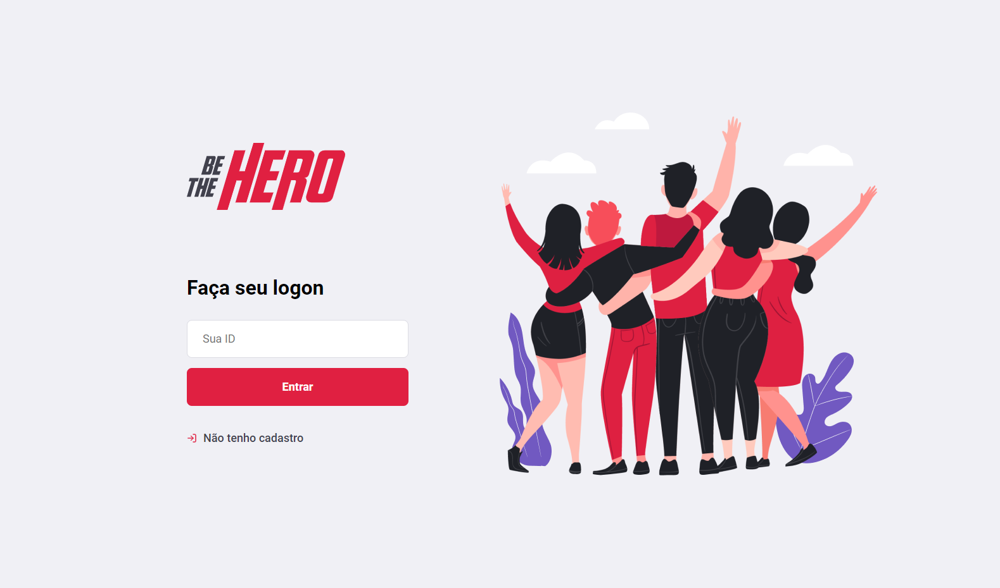
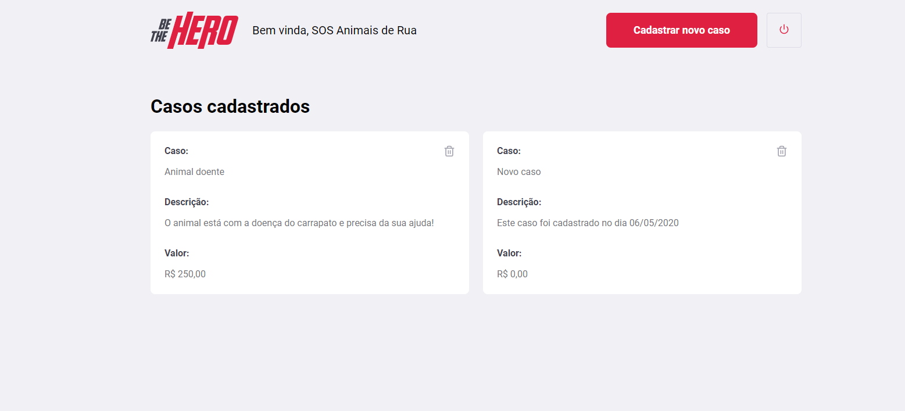
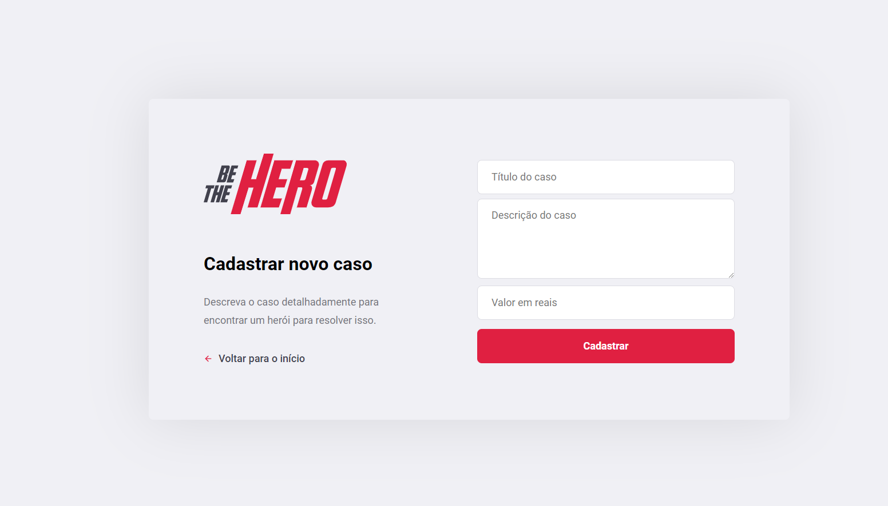

# Sobre
Este projeto foi realizado durante a Semana Omnistack 11 da Rocketseat. O objetivo do Be the Hero é conectar pessoas que querem ajudar com ONGS que querem ser ajudadas. Para tanto, as ongs lançam os casos que precisam ser ajudados por outras pessoas no web e o aplicativo mobile consome esses dados, conectando as pessoas às ONGS.

## Iniciando
- Clone este projeto
- Instale todas as dependências (em cada módulo da aplicação: web, mobile, server)
- Inicie os módulos (comece pelo server)

## Rotas da aplicação
`GET: /ongs`: Retorna todas as ONGs

`POST: /ongs`: Cria uma nova ONG

`POST: /incidents`: Cria um novo caso

`GET: /incidents`: Retorna todos os casos

`DELETE: /incidents/:id`: Retorna um caso específico

`GET: /profile`: Retorna o perfil de uma ONG em específica

`POST: /sessions`: Faz login de uma ONG

## Screenshots

### Página inicial

### Página de casos

### Página de cadastro de casos

## Stack utilizada
* Node.js
* React.js
* React Native
